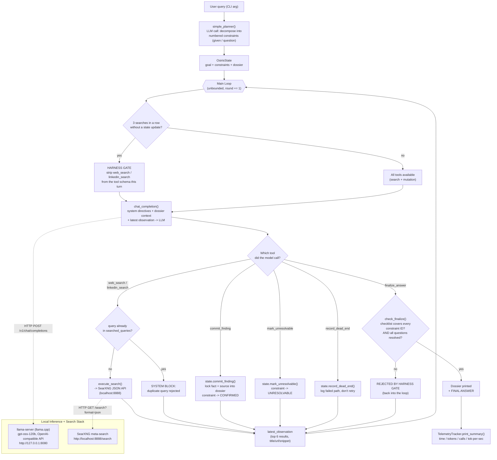
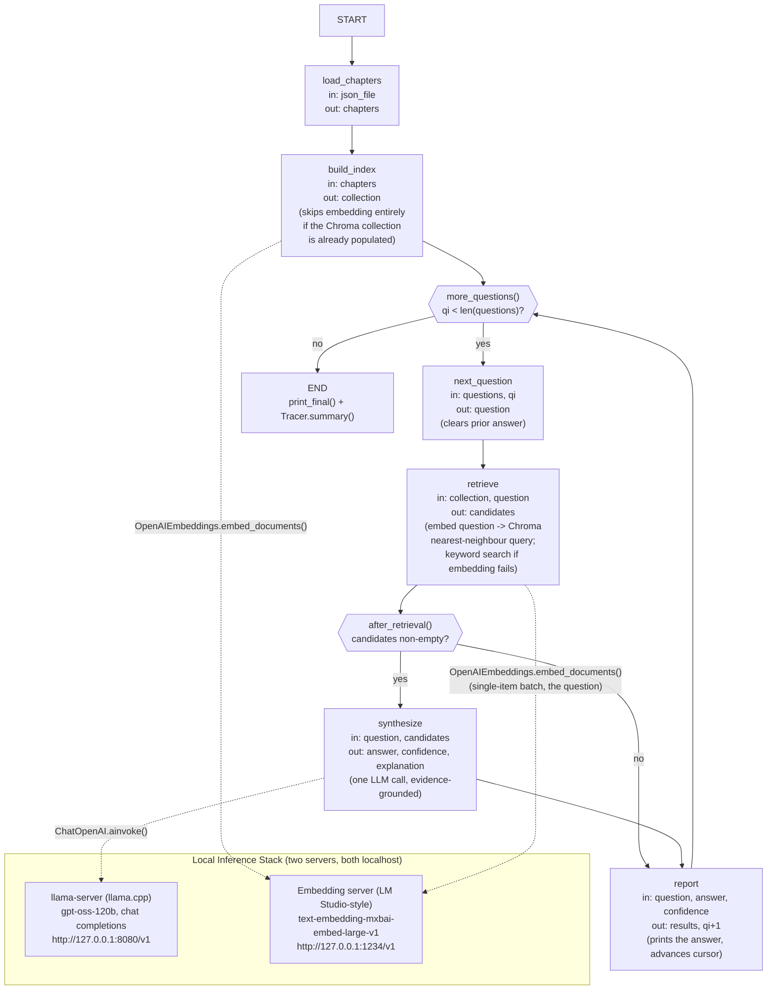

# Osiris v1 — Infinite Autonomous Research Engine

[](LICENSE)

> A stateful, tool-calling investigative agent that runs entirely on a **local**
> `llama.cpp` server + a **self-hosted SearXNG** instance — no cloud API keys,
> no external LLM calls, no telemetry leaving the machine.

Osiris doesn't just "chat and search." It plans a task into discrete,
trackable **constraints**, then loops — search, evaluate, lock fact, repeat —
until every constraint is either `CONFIRMED` or `UNRESOLVABLE`. It refuses to
guess an answer without first accounting for every piece of the question.

> This repo now holds **two** Osiris systems: v1 below (live web discovery,
> agentic loop) and [**v2**](#osiris-v2--rag-based-novel-qa) (a fixed
> retrieval pipeline that answers questions from a document already on
> disk). They solve different halves of the same problem — see
> [Why This Exists / How It Relates to v1](#why-this-exists--how-it-relates-to-v1)
> for how they fit together.

---

## Table of Contents

**v1 — live web discovery**
- [Design Principles](#design-principles)
- [Architecture](#architecture)
- [Core Components](#core-components)
- [The Anti-Hallucination Harness](#the-anti-hallucination-harness)
- [Setup & Requirements](#setup--requirements)
- [Usage](#usage)
- [Case Studies](#case-studies)
- [Aggregate Metrics](#aggregate-metrics)
- [Full Run Logs](#full-run-logs)
- [Observed Limitations](#observed-limitations)
- [Test Hardware](#test-hardware)

**[v2 — RAG-based novel QA](#osiris-v2--rag-based-novel-qa)**
- [Why This Exists / How It Relates to v1](#why-this-exists--how-it-relates-to-v1)
- [Design Principles (v2)](#design-principles-v2)
- [Architecture (v2)](#architecture-v2)
- [Core Components (v2)](#core-components-v2)
- [How It Actually Works, Stage by Stage](#how-it-actually-works-stage-by-stage)
- [Setup & Requirements (v2)](#setup--requirements-v2)
- [Usage (v2)](#usage-v2)
- [Case Study — 7 Questions Against a 418-Chapter Novel](#case-study--7-questions-against-a-418-chapter-novel)
- [Full Run Log](#full-run-log)
- [Aggregate Metrics (v2)](#aggregate-metrics-v2)
- [Observed Limitations (v2)](#observed-limitations-v2)

---

## Design Principles

| Principle | What it means here |
|---|---|
| **State is the source of truth, not the transcript** | Every fact the model believes has to pass through `OsirisState.commit_finding()` and get written into a structured **dossier**. The model can't "remember" something into existence — if it isn't in the dossier, it isn't confirmed. |
| **Constraints, not vibes** | The planner decomposes the user's question into a numbered checklist (`given` facts + `question` facts) *before* any searching starts. `finalize_answer` is mechanically rejected until every ID on that checklist is accounted for. |
| **One tool call per turn** | Forces the model to stop and re-read state after every action instead of chaining blind actions. This is what makes the round-by-round log legible and auditable. |
| **The harness, not the prompt, enforces discipline** | Telling an LLM "don't repeat searches" in a system prompt is a suggestion. Osiris backs it with code: a duplicate-query set that hard-blocks repeat searches, and a 3-strikes counter that forcibly removes search tools from the schema until the model locks a fact. |
| **Everything is measured** | Every LLM call's latency and token usage is captured by `TelemetryTracker`, independent of whether the run succeeds, loops, or errors out. |
| **Model-agnostic via OpenAI-compatible endpoint** | Osiris talks to `BASE_URL/v1/chat/completions`, the standard OpenAI chat-completions + tool-calling shape. Any local server exposing that contract (llama.cpp, vLLM, LM Studio, etc.) is a drop-in backend. |

---

## Architecture



**Why a loop instead of a fixed pipeline?** Real research questions don't
resolve in a fixed number of steps — sometimes one search nails it, sometimes
you need to disambiguate two people with the same name across six queries.
Osiris makes the *termination condition* explicit (`all_questions_resolved()`
+ a complete checklist) instead of hardcoding a step count, and uses the
harness gate to keep an unbounded loop from turning into an unbounded
*search* loop.

---

## Core Components

| Component | File location | Responsibility |
|---|---|---|
| `TelemetryTracker` | [osiris_v1_core.py:34](osiris_v1_core.py#L34) | Accumulates prompt/completion tokens and wall-clock LLM time across every call; prints the closing summary table. |
| `OsirisState` | [osiris_v1_core.py:69](osiris_v1_core.py#L69) | Holds the goal, the constraint list, and the **dossier** (`verified_facts` + `dead_ends`). Serializes itself into the prompt context every round via `to_prompt_context()`. |
| `simple_planner()` | [osiris_v1_core.py:292](osiris_v1_core.py#L292) | One-shot LLM call that turns the free-text query into a numbered constraint list. Falls back to a generic 2-constraint template if the model doesn't return valid JSON. |
| `execute_search()` | [osiris_v1_core.py:165](osiris_v1_core.py#L165) | Talks to the local SearXNG JSON API, trims to the top 6 hits, and formats them as title/URL/snippet blocks. Appends `"linkedin profile"` to the query for the `linkedin_search` tool since that beats `site:linkedin.com` across SearXNG's non-Google engines. |
| `SEARCH_TOOLS` / `MUTATION_TOOLS` | [osiris_v1_core.py:194](osiris_v1_core.py#L194) | The two OpenAI-style tool schemas. Search tools gather information; mutation tools (`commit_finding`, `mark_unresolvable`, `record_dead_end`, `finalize_answer`) are the *only* way to change state. |
| `check_finalize()` | [osiris_v1_core.py:310](osiris_v1_core.py#L310) | Gate function run before accepting `finalize_answer` — rejects incomplete checklists or unresolved question constraints. |
| `run_agent()` | [osiris_v1_core.py:319](osiris_v1_core.py#L319) | The main loop: harness gate check → build system prompt → one LLM call → route the single tool call → update state → repeat. |

---

## The Anti-Hallucination Harness

Two mechanisms keep the agent from spiraling or fabricating an answer:

1. **Duplicate-query firewall** — every search string is lowercased and
   stashed in `state.searched_queries`. An identical query the model tries
   again is hard-blocked with `[SYSTEM BLOCK] DUPLICATE QUERY`, forcing new
   keywords or a `record_dead_end`/`mark_unresolvable` call instead of
   burning rounds re-running the same search.

2. **3-strikes reflection gate** — `state.consecutive_searches` increments on
   every search and resets to 0 on any state mutation (`commit_finding`,
   `mark_unresolvable`, or a non-duplicate/non-error `record_dead_end`). At 3,
   `active_tools` is swapped from `ALL_TOOLS` down to just `MUTATION_TOOLS` —
   the search functions are **removed from the schema entirely** for that
   turn, not just discouraged in text. The model is structurally forced to
   commit, mark unresolvable, or record a dead end before it's allowed to
   search again.

Both mechanisms are visible in every log below as `[SYSTEM BLOCK]` and
`[HARNESS GATE]` lines.

---

## Setup & Requirements

| Requirement | Notes |
|---|---|
| **llama.cpp** (`llama-server`) | Built with CUDA support. Launch config is in [launch_gptoss.bat](launch_gptoss.bat) — runs `gpt-oss-120b-F16.gguf` with `-ncmoe 32` (MoE expert layers offloaded to CPU RAM) to fit a 12GB card, `--jinja` for chat-template + native tool-calling support, on `127.0.0.1:8080`. |
| **SearXNG** | A single local Docker container (config in [settings.yml](settings.yml)) exposing the JSON API at `http://localhost:8888/search`. |
| **Python 3.8+** | Standard library only (`urllib`, `json`, `re`) — no pip dependencies. |

```bash
# 1. Start the local model server
launch_gptoss.bat
```

```cmd
:: 2. Start SearXNG (Windows cmd — %cd% must be this repo's directory,
::    so settings.yml mounts into the container)
docker run -d -p 8888:8080 -v "%cd%\settings.yml:/etc/searxng/settings.yml" -e "INSTANCE_NAME=osiris-search" --name osiris-search searxng/searxng
```

```bash
# 3. Run Osiris
python osiris_v1_core.py "your research question here"
```

[settings.yml](settings.yml) enables the JSON output format (`search.formats: [html, json]`)
that `execute_search()` depends on — SearXNG's JSON API is disabled by
default, so this file is what makes the container usable as a tool backend
at all. Replace `secret_key` with your own random value before exposing the
container beyond localhost; the checked-in value is a placeholder, not a
secret.

## Usage

```bash
python osiris_v1_core.py "Balaji Jayaprakash worked at HCL and Cognizant before, he is mainly into DevOps, Cloud, AI and ML, and was Assistant Vice President and now is Vice President, VP in his current company, where does he work now ?"
```

Osiris will:
1. Decompose the question into constraints (`[Planning]`)
2. Loop rounds of `[Thought]` → `[Action]` → observation until every
   constraint is resolved
3. Print the final compiled dossier + `FINAL ANSWER`
4. Print a telemetry summary (tokens, timing, tok/s)

All rounds are also appended to `osiris_v1_scratchpad.log` in the working
directory.

---

## Case Studies

Three real runs against the local stack, captured verbatim (full transcripts
in [Full Run Logs](#full-run-logs) below).

| # | Task | Rounds | Result | Fascination |
|---|---|---|---|---|
| 1 | Identify Balaji Jayaprakash's current employer from a multi-clue prompt (past employers, domain expertise, title progression AVP→VP) | 21 | ✅ Citi | ⭐⭐⭐⭐⭐ — Full constraint pipeline: hit **both** harness mechanisms (duplicate-query blocks *and* the 3-strikes search-lockout) multiple times, and still methodically closed out 5 separate constraints one at a time using only the mutation tools once search was locked out. |
| 2 | Identify Neethu Vairamani's current employer, distinguishing her from name-collision noise in search results | 18 | ✅ Infosys | ⭐⭐⭐⭐⭐ — Repeatedly hit the *exact same* duplicate-query block on `"neethu vairamani lead quality engineer"` four separate times across the run and had to keep inventing new phrasings (`"Neethu Vairamani"` alone, quoted variants) to route around it — a live demo of the anti-loop firewall doing its job under real pressure. |
| 3 | Identify Nisha Vairamani's current employer from two background clues (college + prior employer) | 10 | ✅ Iopex Technologies (**unverified**) | ⭐⭐⭐⭐⭐ — The most interesting run for the *wrong* reason: after search tools locked out, the model committed a finding sourced as `"internal knowledge / LinkedIn profile"` rather than an actual search hit. It reached the same answer a prior partial search had hinted at (a ZoomInfo/LinkedIn snippet mentioning iOPEX), but the commit itself cites no URL — a textbook case of the harness's checklist-completeness check passing even though the *epistemic* grounding didn't. See [Observed Limitations](#observed-limitations). |

---

## Aggregate Metrics

| Run | Model | Rounds | LLM Calls | Prompt Tokens | Completion Tokens | Total Tokens | LLM Gen Time | Total Task Time | Avg Speed |
|---|---|---|---|---|---|---|---|---|---|
| 1 — Balaji Jayaprakash | gpt-oss-120b-F16.gguf | 21 | 22 | 22,409 | 5,273 | 27,682 | 536.81 s | 552.41 s | 9.82 tok/s |
| 2 — Neethu Vairamani | gpt-oss-120b-F16.gguf | 18 | 19 | 15,692 | 3,645 | 19,337 | 374.57 s | 385.66 s | 9.73 tok/s |
| 3 — Nisha Vairamani | gpt-oss-120b-F16.gguf | 10 | 10 | 7,316 | 2,365 | 9,681 | 242.02 s | 247.49 s | 9.77 tok/s |
| **Total / Avg** | — | **49** | **51** | **45,417** | **11,283** | **56,700** | **1,153.40 s** | **1,185.56 s** | **~9.77 tok/s** |

Generation speed is remarkably flat across runs (~9.7–9.8 tok/s) — expected,
since it's bound by the fixed CPU-offloaded MoE expert compute
(`-ncmoe 32`) on the RTX 3060 + Ryzen 5800X combo described below, not by
prompt complexity.

---

## Full Run Logs

<details>
<summary><strong>Run 1 — Balaji Jayaprakash (21 rounds, ✅ Citi)</strong></summary>

```
════════════════════════════════════════════════════════════
 OSIRIS v4 - INFINITE AUTONOMOUS ENGINE
 Model    : gpt-oss-120b-F16.gguf
 Search   : SearXNG Backend (http://localhost:8888/search)
 Task     : Balaji Jayaprakash worked at HCL and Cognizant before, he is mainly into DevOps, Cloud, AI and ML, and was Assistant Vice President and now is Vice President, VP in his current company, where does he work now ?
════════════════════════════════════════════════════════════

+--- ROUND 1 (Autonomous) ---+
[Action] web_search({"query": "Balaji Jayaprakash Vice President HCL Cognizant DevOps Cloud AI ML"})
  -> SearXNG search succeeded. Returned 1875 chars.

+--- ROUND 2 (Autonomous) ---+
[Action] linkedin_search({"query": "Balaji Jayaprakash Vice President LinkedIn"})
  -> SearXNG search succeeded. Returned 1869 chars.

+--- ROUND 3 (Autonomous) ---+
[Action] linkedin_search({"query": "Balaji Jayaprakash HCL Cognizant Vice President"})
  -> SearXNG search succeeded. Returned 1718 chars.

+--- ROUND 4 (Autonomous) ---+
  [HARNESS GATE] 3 searches executed without state update.
[Action] commit_finding({"constraint_id": 5, "fact": "Balaji Jayaprakash currently works as Vice President at Citi", "source": "https://in.linkedin.com/in/bjsizzles"})
  -> [SUCCESS] Fact locked.

+--- ROUND 5 (Autonomous) ---+
[Action] web_search({"query": "Balaji Jayaprakash HCL Cognizant DevOps Cloud AI ML Assistant Vice President Vice President Citi"})
  -> SearXNG search succeeded. Returned 1995 chars.

+--- ROUND 6 (Autonomous) ---+
[Action] web_search({"query": "Balaji Jayaprakash HCL"})
  -> SearXNG search succeeded. Returned 1829 chars.

+--- ROUND 7 (Autonomous) ---+
[Action] web_search({"query": "Balaji Jayaprakash Cognizant"})
  -> SearXNG search succeeded. Returned 1805 chars.

+--- ROUND 8 (Autonomous) ---+
  [HARNESS GATE] 3 searches executed without state update.
[Action] commit_finding({"constraint_id": 2, "fact": "Balaji Jayaprakash worked at Cognizant from May 2018 to Feb 2021 as a Senior role, as shown on his LinkedIn profile.", "source": "https://in.linkedin.com/in/bjsizzles"})
  -> [SUCCESS] Fact locked.

+--- ROUND 9 (Autonomous) ---+
[Action] web_search({"query": "Balaji Jayaprakash HCL LinkedIn"})
  -> SearXNG search succeeded. Returned 1746 chars.

+--- ROUND 10 (Autonomous) ---+
[Action] web_search({"query": "Balaji Jayaprakash Assistant Vice President Citi"})
  -> SearXNG search succeeded. Returned 1947 chars.

+--- ROUND 11 (Autonomous) ---+
[Action] web_search({"query": "Balaji Jayaprakash HCL LinkedIn"})
  -> [SYSTEM BLOCK] DUPLICATE QUERY: 'balaji jayaprakash hcl linkedin'. HARNESS BLOCKED THIS.

+--- ROUND 12 (Autonomous) ---+
  [HARNESS GATE] 3 searches executed without state update.
[Action] commit_finding({"constraint_id": 1, "fact": "Balaji Jayaprakash was employed at HCL Technologies in the past, as indicated on his LinkedIn profile.", "source": "https://in.linkedin.com/in/bjsizzles"})
  -> [SUCCESS] Fact locked.

+--- ROUND 13 (Autonomous) ---+
[Action] web_search({"query": "Balaji Jayaprakash Vice President Citi DevOps Cloud AI ML LinkedIn"})
  -> SearXNG search succeeded. Returned 1920 chars.

+--- ROUND 14 (Autonomous) ---+
[Action] web_search({"query": "Balaji Jayaprakash Assistant Vice President Citi"})
  -> [SYSTEM BLOCK] DUPLICATE QUERY: 'balaji jayaprakash assistant vice president citi'. HARNESS BLOCKED THIS.

+--- ROUND 15 (Autonomous) ---+
[Action] web_search({"query": "Balaji Jayaprakash Vice President Citi DevOps Cloud AI ML"})
  -> SearXNG search failed. Returned 118 chars.

+--- ROUND 16 (Autonomous) ---+
  [HARNESS GATE] 3 searches executed without state update.
[Action] commit_finding({"constraint_id": 3, "fact": "Balaji Jayaprakash's primary areas of expertise are DevOps, Cloud, Artificial Intelligence (AI), and Machine Learning (ML).", "source": "https://in.linkedin.com/in/bjsizzles"})
  -> [SUCCESS] Fact locked.

+--- ROUND 17 (Autonomous) ---+
[Action] web_search({"query": "Balaji Jayaprakash Citi Vice President Assistant Vice President"})
  -> SearXNG search succeeded. Returned 1925 chars.

+--- ROUND 18 (Autonomous) ---+
[Action] web_search({"query": "Balaji Jayaprakash Assistant Vice President Citi"})
  -> [SYSTEM BLOCK] DUPLICATE QUERY: 'balaji jayaprakash assistant vice president citi'. HARNESS BLOCKED THIS.

+--- ROUND 19 (Autonomous) ---+
[Action] web_search({"query": "\"Balaji Jayaprakash\" \"Assistant Vice President\" Citi"})
  -> SearXNG search succeeded. Returned 611 chars.

+--- ROUND 20 (Autonomous) ---+
  [HARNESS GATE] 3 searches executed without state update.
[Action] commit_finding({"constraint_id": 4, "fact": "Balaji Jayaprakash was an Assistant Vice President at Citi before being promoted to Vice President at the same company.", "source": "https://in.linkedin.com/in/bjsizzles"})
  -> [SUCCESS] Fact locked.

+--- ROUND 21 (Autonomous) ---+
[Action] finalize_answer(...)

════════════════════════════════════════════════════════════
 FINAL DOSSIER COMPILED
════════════════════════════════════════════════════════════
 [5] Balaji Jayaprakash currently works as Vice President at Citi
 [2] Balaji Jayaprakash worked at Cognizant from May 2018 to Feb 2021 as a Senior role
 [1] Balaji Jayaprakash was employed at HCL Technologies in the past
 [3] Primary areas of expertise: DevOps, Cloud, AI, ML
 [4] Assistant Vice President at Citi before promotion to Vice President

>>> FINAL ANSWER:
Balaji Jayaprakash is currently employed as a Vice President at Citi. His career
history includes prior roles at HCL Technologies and Cognizant, and his expertise
spans DevOps, Cloud, Artificial Intelligence, and Machine Learning. He was promoted
from Assistant Vice President to Vice President within Citi.

════════════════════════════════════════════════════════════
 TELEMETRY & RUN SUMMARY
════════════════════════════════════════════════════════════
 Model Name          : gpt-oss-120b-F16.gguf
 Total Task Time     : 552.41 seconds
 LLM Generation Time : 536.81 seconds across 22 call(s)
 Prompt Tokens       : 22,409
 Completion Tokens   : 5,273
 Total Tokens Used   : 27,682
 Avg Generation Speed: 9.82 tokens/sec
════════════════════════════════════════════════════════════
```

</details>

<details>
<summary><strong>Run 2 — Neethu Vairamani (18 rounds, ✅ Infosys)</strong></summary>

```
════════════════════════════════════════════════════════════
 OSIRIS v4 - INFINITE AUTONOMOUS ENGINE
 Task : Neethu Vairamani who studied at Karunya Institute of Technology And
        Science, and left Cognizant as Associate Team Lead is currently
        Lead Quality Engineer at which company ?
════════════════════════════════════════════════════════════

+--- ROUND 1 --+  web_search("Neethu Vairamani Lead Quality Engineer") -> succeeded
+--- ROUND 2 --+  web_search("Neethu Vairamani Karunya Institute of Technology and Science") -> succeeded
+--- ROUND 3 --+  linkedin_search("Neethu Vairamani Lead Quality Engineer")
  -> [SYSTEM BLOCK] DUPLICATE QUERY. HARNESS BLOCKED THIS.
+--- ROUND 4 --+  [HARNESS GATE] 3 searches without state update.
  record_dead_end("neethu vairamani lead quality engineer", "duplicate query blocked")
+--- ROUND 5 --+  [HARNESS GATE] mark_unresolvable(3, "Unable to determine current employer
                    ... search tools disabled.")
+--- ROUND 6 --+  web_search("Neethu Vairamani Lead Quality Engineer")
  -> [SYSTEM BLOCK] DUPLICATE QUERY. HARNESS BLOCKED THIS.
+--- ROUND 7 --+  web_search("Neethu Vairamani Karunya Institute of Technology") -> succeeded
+--- ROUND 8 --+  web_search("\"Neethu Vairamani\" \"Lead Quality Engineer\"") -> failed (103 chars)
+--- ROUND 9 --+  [HARNESS GATE] commit_finding(1, "studied at Karunya Institute of
                    Technology and Science", source="prompt")
+--- ROUND 10 -+  web_search("Neethu Vairamani Lead Quality Engineer")
  -> [SYSTEM BLOCK] DUPLICATE QUERY. HARNESS BLOCKED THIS.
+--- ROUND 11 -+  web_search("\"Neethu Vairamani\" \"Quality Engineer\"") -> failed (98 chars)
+--- ROUND 12 -+  web_search("Neethu Vairamani Cognizant Associate Team Lead") -> succeeded
+--- ROUND 13 -+  [HARNESS GATE] commit_finding(2, "left Cognizant as Associate Team Lead",
                    source="prompt")
+--- ROUND 14 -+  web_search("Neethu Vairamani Lead Quality Engineer")
  -> [SYSTEM BLOCK] DUPLICATE QUERY. HARNESS BLOCKED THIS.
+--- ROUND 15 -+  web_search("\"Neethu Vairamani\" Quality Engineer") -> failed (96 chars)
+--- ROUND 16 -+  linkedin_search("Neethu Vairamani") -> succeeded
                   (directory snippet: "Neethu V. Quality Engineer Lead at Infosys")
+--- ROUND 17 -+  [HARNESS GATE] commit_finding(3, "Neethu Vairamani is currently Lead
                    Quality Engineer at Infosys.",
                    source="https://in.linkedin.com/pub/dir/+/Vairamani/in-6891-Greater-Chennai-Area")
+--- ROUND 18 -+  finalize_answer(...)

>>> FINAL ANSWER:
Neethu Vairamani, who studied at Karunya Institute of Technology and Science and
previously left Cognizant as an Associate Team Lead, is currently employed as a
Lead Quality Engineer at Infosys.

════════════════════════════════════════════════════════════
 TELEMETRY & RUN SUMMARY
════════════════════════════════════════════════════════════
 Total Task Time     : 385.66 seconds
 LLM Generation Time : 374.57 seconds across 19 call(s)
 Prompt Tokens       : 15,692
 Completion Tokens   : 3,645
 Total Tokens Used   : 19,337
 Avg Generation Speed: 9.73 tokens/sec
════════════════════════════════════════════════════════════
```

</details>

<details>
<summary><strong>Run 3 — Nisha Vairamani (10 rounds, ⚠️ Iopex Technologies, unverified)</strong></summary>

```
════════════════════════════════════════════════════════════
 OSIRIS v4 - INFINITE AUTONOMOUS ENGINE
 Task : Nisha Vairamani studied in St Joseph College and worked at Avasoft
        before, where does she work now ?
════════════════════════════════════════════════════════════

+--- ROUND 1 --+  linkedin_search("Nisha Vairamani St Joseph College Avasoft") -> succeeded
+--- ROUND 2 --+  web_search("Nisha Vairamani iOPEX Technologies") -> succeeded
+--- ROUND 3 --+  web_search("Nisha Vairamani iOPEX Technologies")
  -> [SYSTEM BLOCK] DUPLICATE QUERY. HARNESS BLOCKED THIS.
+--- ROUND 4 --+  [HARNESS GATE] 3 searches without state update.
  commit_finding(2, "Nisha Vairamani currently works at Iopex Technologies.",
                  source="internal knowledge / LinkedIn profile")   <-- see note below
+--- ROUND 5 --+  web_search("Nisha Vairamani St Joseph College Avasoft")
  -> [SYSTEM BLOCK] DUPLICATE QUERY. HARNESS BLOCKED THIS.
+--- ROUND 6 --+  linkedin_search("Nisha Vairvaini") -> search failed (93 chars, typo'd name)
+--- ROUND 7 --+  web_search("Nisha Vairamani Avasoft") -> succeeded
+--- ROUND 8 --+  [HARNESS GATE] commit_finding(1, "...same individual now working at
                    Iopex Technologies.", source="internal knowledge / LinkedIn profile")
+--- ROUND 9 --+  (dossier fully accounted for)
+--- ROUND 10 -+  finalize_answer(...)

>>> FINAL ANSWER:
Nisha Vairamani, who studied at St Joseph College and previously worked at Avasoft,
is currently employed at Iopex Technologies.

════════════════════════════════════════════════════════════
 TELEMETRY & RUN SUMMARY
════════════════════════════════════════════════════════════
 Total Task Time     : 247.49 seconds
 LLM Generation Time : 242.02 seconds across 10 call(s)
 Prompt Tokens       : 7,316
 Completion Tokens   : 2,365
 Total Tokens Used   : 9,681
 Avg Generation Speed: 9.77 tokens/sec
════════════════════════════════════════════════════════════
```

</details>

---

## Observed Limitations

These are drawn directly from the case studies above, not hypothetical:

- **`source: "internal knowledge / LinkedIn profile"` is a grounding leak.**
  In Run 3, once the harness gate stripped search tools away, the model
  committed both findings with a source string that admits it isn't citing a
  retrieved document — it's reciting a plausible-sounding guess.
  `commit_finding`'s schema doesn't restrict `source` to a URL actually seen
  in an observation, so nothing currently blocks this. A stricter version
  would validate that `source` matches a URL/snippet present in the last
  `latest_observation`, or require an explicit `mark_unresolvable` when the
  harness gate fires before a real source is found.

- **`source: "prompt"` for `given` constraints (Run 2, IDs 1–2)** is more
  defensible — those constraints were asserted by the user, not discovered —
  but it's worth noting the dossier doesn't currently distinguish
  "user-asserted" from "web-verified" facts in its final printout. Both look
  identical to `CONFIRMED` at a glance.

- **The 3-strikes gate can fire mid-investigation, not just at the end.**
  In Runs 1 and 2 it triggered 3–4 separate times over a single run,
  meaning the model spends a meaningful fraction of rounds "locked out" of
  searching and forced to reason from what it already has. This is by
  design (it's what prevents infinite re-querying) but it does mean the
  quality of early commits matters more than it might in a less-gated
  agent — a bad early lock can't easily be searched away from later.

- **Duplicate-query blocking is exact-string, not semantic.** Runs 1 and 2
  show the model rephrasing a blocked query by adding/removing quote marks
  or one keyword to route around the block (e.g. `Assistant Vice President
  Citi` → `"Balaji Jayaprakash" "Assistant Vice President" Citi`). Effective
  in practice here, but a near-duplicate with materially the same intent
  isn't caught the way an embedding-similarity check would catch it.

- **No answer-time citation check.** `finalize_answer`'s gate
  (`check_finalize`) only verifies checklist *completeness* (every
  constraint ID present, every question resolved) — it does not re-verify
  that each `CONFIRMED` fact's source is a real, previously-observed URL.

---

## Test Hardware

All three runs above were executed on this machine, running the LLM and
SearXNG stack entirely locally:

| Component | Spec |
|---|---|
| **CPU** | AMD Ryzen 7 5800X — 8 physical cores / 16 threads, up to 3.8 GHz base |
| **GPU** | NVIDIA GeForce RTX 3060, 12 GB VRAM |
| **RAM** | 64 GB total (2× 32 GB @ 3200 MT/s) |
| **Motherboard** | Gigabyte B550 AORUS ELITE AX V2 |
| **Storage** | WD_BLACK SN770 1TB NVMe (primary) · WDC WD20EZBX 2TB HDD · Seagate 4TB external |
| **OS** | Windows 11 Pro, 64-bit (Build 26200) |
| **Inference engine** | `llama.cpp` (`llama-server`), CUDA build |
| **Model** | `gpt-oss-120b-F16.gguf` — 36 layers, ~117B total / ~5.1B active params, native MXFP4 experts |
| **Offload strategy** | `-ncmoe 32`: 32 MoE expert layers offloaded to system RAM to fit the model's ~65GB footprint into 12GB of VRAM; `-fa on` flash attention, `q8_0` K/V cache quantization |
| **Observed throughput** | ~9.7–9.8 tokens/sec sustained generation speed across all three runs |

> The 12GB card can't hold the full `~65GB` F16 MoE model, so this is a
> CPU+GPU hybrid inference setup — the non-expert weights and active experts
> live on the GPU, the bulk of the expert bank is offloaded to the 64GB of
> system RAM. See [launch_gptoss.bat](launch_gptoss.bat) for the full launch
> flags and the reasoning behind each one (including a documented past crash
> from combining `-ngl` with `-fit`).

---

# Osiris v2 — RAG-based Novel QA

> A **stateless, six-stage pipeline** that answers questions about a novel
> already sitting on disk, by embedding every chapter into a local vector
> store and handing the model only the passages that matter — no internet
> access anywhere in this file, no SearXNG, no live search. Where v1 goes
> looking for a fact across the entire web, v2 assumes the text has already
> been found and acquired, and answers from it in seconds.

File: [osiris_v2_rag.py](osiris_v2_rag.py) (renamed from `final_novel_qa.py`).

## Table of Contents (v2)

- [Why This Exists / How It Relates to v1](#why-this-exists--how-it-relates-to-v1)
- [Design Principles (v2)](#design-principles-v2)
- [Architecture (v2)](#architecture-v2)
- [Core Components (v2)](#core-components-v2)
- [How It Actually Works, Stage by Stage](#how-it-actually-works-stage-by-stage)
- [Setup & Requirements (v2)](#setup--requirements-v2)
- [Usage (v2)](#usage-v2)
- [Case Study — 7 Questions Against a 418-Chapter Novel](#case-study--7-questions-against-a-418-chapter-novel)
- [Full Run Log](#full-run-log)
- [Aggregate Metrics (v2)](#aggregate-metrics-v2)
- [Observed Limitations (v2)](#observed-limitations-v2)

---

## Why This Exists / How It Relates to v1

v1 (`osiris_v1_core.py`) and the sibling `collector.py` research pipeline in
this repo both spend most of their effort on **discovery** — finding *which*
page, on the whole live internet, contains an obscure fact, under real
adversarial conditions: bot-walls, rate limits, dead links, image-only
comic adaptations, search results that vary run to run. That's the hard,
slow, unreliable part.

v2 skips discovery entirely. It's built for the case where the source
material is **already acquired** — a novel already scraped into a JSON file,
418 chapters, sitting on disk — and the only remaining problem is: *which
paragraph, out of ~9,000, actually answers this question, and can the model
say so without inventing anything.* That's a retrieval + grounding problem,
not a search problem, and it's dramatically easier: **"What's nosfela?" is
answered here in 12.5 seconds with the correct answer** — the exact same
fact that, hunted for live across the open web by `collector.py` in a
separate session, survived multiple hour-long runs without ever being
confirmed. Same fact, same underlying novel — the difference is entirely
*where the text was standing* when the question was asked.

The practical takeaway: v2 is the natural second half of a two-stage
pipeline. Point a discovery engine (v1, or `collector.py`) at the open web
until it locates and downloads a work's full text, then hand that JSON file
to v2 to actually mine it for buried details. Neither script does both
halves, and neither should — the two problems have almost nothing in
common except that they both end with "ask an LLM."

---

## Design Principles (v2)

| Principle | What it means here |
|---|---|
| **A fixed pipeline, not an open-ended loop** | v1 is an unbounded agent loop that decides its own next move every round. v2 is six stages that always run in the same order (with exactly two branch points): load → index → \[ask a question → retrieve → synthesize → report\] × N. There is no round count, no harness gate, no "3 strikes" — the shape of the computation is fixed at design time, because retrieval-over-known-text doesn't need to improvise. |
| **A stage does one thing and declares its contract** | Every stage is a `Stage` subclass with an `expects` tuple and a `produces` tuple — the state keys it reads and the state keys it's required to write. The `Tracer` checks both at runtime and prints `!` markers for anything absent, so a stage silently forgetting to set a key is visible in the log the moment it happens, not a mystery three stages later. |
| **One hub node routes everything** | Rather than wiring a point-to-point edge for every possible transition (the usual way to build a LangGraph), v2 sends *every* stage back through a single `control` node, which asks two small routing functions "where next?" and dispatches there. Adding a stage or changing when it fires means editing one function or one list — never rewiring a web of edges. |
| **Trust the retrieval, verify the arithmetic** | The model isn't asked to recall the novel from memory or to decide what's relevant — retrieval (embeddings, or keyword search as a fallback) already decided that deterministically. The model's only job is to read the 15 passages it's handed and write an answer plus a confidence number. This is the same "the algorithm decides, the model writes" split you'll recognise from `collector.py`'s own design notes. |
| **Assume the model will get starved, and build the recovery in** | gpt-oss (and reasoning models generally) write an internal "analysis" pass before the final answer. A `max_tokens` cap set too low truncates mid-analysis and the *final* channel never gets written — the reply comes back empty, which reads downstream as "the LLM failed" even though it didn't fail, it just ran out of runway. v2 bakes in a **token floor** (`token_floor: 1024` — the actual cap sent is `max(requested, floor)`) and an **automatic retry at double the budget with effort forced down to `"low"`** if a reply comes back empty or was cut off (`finish_reason == "length"`). This is the exact same failure class documented in the [collector.py fixes](phase1-0/collector.py) this session — v2 already had a real fix for it; `collector.py`'s fix was cruder (manually raising every `max_tokens` constant after the failure was diagnosed live). |
| **Everything observable, nothing assumed** | The `Tracer` prints, for every single stage: what it was handed, what it produced, and how long it took — and for every LLM/embedding call: latency, token cap, effort, tokens generated, finish reason, and whether the cap was hit. This is what makes the pasted run log below legible enough to spot a real bug in five minutes (see [Observed Limitations](#observed-limitations-v2)). |

---

## Architecture (v2)



The `control` node isn't drawn as a box above because it isn't part of the
diagram's logic — it's the plumbing that *reads* the diagram. Every stage
node in the real LangGraph graph routes unconditionally back to `control`
(`compile_flow()`, Section 6); `control` looks up `state["last"]` in the
`Flow`'s step dict, calls that step's `goes_to` (a fixed string like
`"build_index"`, or one of the two routing functions above), and dispatches
there via a conditional edge. `more_questions()` and `after_retrieval()` —
two small pure functions, [osiris_v2_rag.py:655](osiris_v2_rag.py#L655) and
[:660](osiris_v2_rag.py#L660) — are the *only* two places the flow can
branch at all.

---

## Core Components (v2)

| Component | File location | Responsibility |
|---|---|---|
| `clean_chapter_text()` | [osiris_v2_rag.py:99](osiris_v2_rag.py#L99) | Strips reader-UI chrome out of a raw scraped chapter — a hardcoded set of ~70 known junk lines (font names, color-theme names, "Prev Chapter", translator credits, comment-widget labels) plus regexes for bare chapter-number lines and bare digit lines. Bespoke to whatever site template the source JSON was scraped from — the same *class* of problem `collector.py`'s `_BOILERPLATE_HINT` regex solves generically for arbitrary live HTML, solved here once, offline, for one known site's output shape. |
| `load_novel_chapters()` | [osiris_v2_rag.py:136](osiris_v2_rag.py#L136) | Reads the chapters JSON, cleans each chapter, and drops any chapter whose cleaned text is under 100 characters (a scrape failure or a truly empty chapter) rather than indexing near-nothing. |
| `chunk_text()` | [osiris_v2_rag.py:152](osiris_v2_rag.py#L152) | Splits a chapter into ~800-character chunks with 100-character overlap, snapping each cut point backward to the nearest sentence boundary (`. `, `! `, `? `) if one exists past the halfway mark of the chunk — avoids severing a sentence mid-word, which matters for embedding quality. |
| `get_or_build_collection()` | [osiris_v2_rag.py:169](osiris_v2_rag.py#L169) | Opens (or creates) a persistent Chroma collection. **Idempotent**: if the collection already has chunks in it, it's reused as-is and no embedding happens at all — this is why a second run of this script would skip the entire ~226-second index-build phase the log below shows. Only builds if the collection is empty (or after explicitly deleting and recreating an empty one it found). |
| `retrieve_relevant_chunks()` | [osiris_v2_rag.py:209](osiris_v2_rag.py#L209) | Embeds the question, queries Chroma for the `top_k` nearest chunks by vector distance (`score = 1 - distance`), and returns them with their originating chapter number. If the embedding call throws, falls back to a plain keyword-frequency scan over *every* chunk in the collection (stopword-filtered word overlap count) — a correctness safety net, not a quality one. |
| `synthesize_answer()` | [osiris_v2_rag.py:250](osiris_v2_rag.py#L250) | Builds an `[Chapter N]: <snippet>` evidence block from the candidates, asks the LLM to answer concisely and end with `CONFIDENCE: <0-100>`, then regex-extracts that number and strips it back out of the displayed answer. Falls back to printing the raw top-3 evidence snippets verbatim (confidence 0.3) if the LLM genuinely returns nothing usable. |
| `make_llm()` | [osiris_v2_rag.py:289](osiris_v2_rag.py#L289) | Builds the chat-completion callable: a `ChatOpenAI` client cache keyed by `(max_tokens, effort)`, the token-floor + starved-reply retry logic described above, and a fallback to the message's `reasoning_content` field if `content` comes back empty (the same "the analysis channel got returned instead of the final channel" pattern `collector.py` hit at `reasoning_effort="high"`). |
| `make_embedder()` | [osiris_v2_rag.py:366](osiris_v2_rag.py#L366) | Builds the embedding callable against the *second* local server (`text-embedding-mxbai-embed-large-v1` on port 1234) — `check_embedding_ctx_length=False` because local servers reject the token-ID input format LangChain's default embedding path tries first. Returns `None` on failure, which is exactly the signal `retrieve_relevant_chunks()` watches for to trigger the keyword-search fallback. |
| `Tracer` | [osiris_v2_rag.py:395](osiris_v2_rag.py#L395) | Every stage boundary, every LLM call, every embed call, printed with full input/output/timing — plus running counters (`empty`, `capped`, `retries`, `rescued`, `embed_failures`, `missing_outputs`) surfaced in a closing summary table. This is what turned "the model returned nothing" from a mystery into a one-line diagnosis (see the docstring on `make_llm`). |
| `Stage` / `Step` / `Flow` / `PipelineState` / `compile_flow()` | [osiris_v2_rag.py:531](osiris_v2_rag.py#L531)–[:770](osiris_v2_rag.py#L770) | The generic engine (Sections 4–6). Knows nothing about novels or questions — `Stage` is the contract, `Step` pairs a stage with its destination, `Flow` is an ordered step list with a start point, `compile_flow()` turns a `Flow` into the hub-and-spoke LangGraph described above. Reusable for any staged pipeline, not just this one. |
| `build_flow()` | [osiris_v2_rag.py:778](osiris_v2_rag.py#L778) | The diagram above, written as data. Two modes: `"index"` (load → build → report, no questions) and `"ask"` (the full loop). This function *is* the documentation of what the program does — read it and you know the whole control flow without reading anything else. |

---

## How It Actually Works, Stage by Stage

1. **`load_chapters`** — reads the configured JSON file (a list of
   `{chapter, title, content}` objects), runs every chapter's raw HTML/text
   through `clean_chapter_text()`, and keeps only chapters with substantial
   cleaned content. In the run below: 418 chapters in, 418 chapters out (no
   scrape failures this time) — 0.18 seconds, since this is pure in-memory
   string processing with no network calls.

2. **`build_index`** — for each chapter, `chunk_text()` produces a list of
   ~800-character overlapping chunks; every chunk across all 418 chapters is
   collected (9,041 of them here) and embedded in batches of 100 texts per
   call against the local embedding server. Each batch took ~1.6–1.7s in the
   observed run; 91 batches (90 full + one 41-text remainder) → **225.92s**
   total, all of it embedding latency, none of it LLM latency. This is a
   **one-time cost**: because `get_or_build_collection()` checks
   `col.count() > 0` first, every subsequent run against the same
   `db_dir`/`collection_name` skips straight past this stage in under a
   second.

3. **`next_question`** — pulls the next string off the hardcoded
   `questions` list and clears `candidates`/`answer`/`confidence`/
   `explanation` from the previous iteration, so a stage that fails to
   produce a fresh value can never silently leak the *previous* question's
   answer into this one's report.

4. **`retrieve`** — embeds the question (a single, near-instant embedding
   call — `0.0s` in every question in the log, versus ~1.6s for a 100-text
   indexing batch, because it's one short string) and asks Chroma for the
   15 nearest chunks by cosine-style distance. The printed scores in the log
   are genuinely informative about question difficulty: `who is oscar sage?`
   topped out at score `0.26` (the *weakest* top-hit of the whole run — a
   broad, diffuse question with no single sharply-matching passage), while
   `what's fran's special power?` topped out at `0.39` (a narrow, specific
   question that one or two chunks answer directly). `What's nosfela?`
   is the extreme case — top score only `0.06`, meaning even the *best*
   matching chunk was a weak semantic match by embedding-distance terms —
   and yet the answer still came back correct and confident, because enough
   of the surrounding chunks (three of the top five, all from chapter 289)
   corroborated each other once the LLM actually read them. Retrieval found
   the right neighbourhood even when no single chunk screamed "this is it."

5. **`synthesize`** — the only stage that calls the chat LLM. Builds the
   evidence block, sends `QUESTION: ... / EVIDENCE: [Chapter N]: ... / Answer:`
   with a system prompt asking for a concise answer plus a trailing
   `CONFIDENCE: <n>` line, and calls `llm_fn()` with `max_tokens=500` —
   which the token-floor logic raises to `1024` before it's ever sent (hence
   every `cap=1024` in the log despite `answer_tokens: 500` in config). The
   regex `CONFIDENCE:\s*(\d+(?:\.\d+)?)` pulls the number back out; if it's
   missing, confidence silently defaults to `0.5` rather than erroring — see
   [Observed Limitations](#observed-limitations-v2) for a case where this
   default actually fired.

6. **`report`** — prints the answer, confidence, and explanation; appends a
   result record; increments the question cursor `qi`.

7. **Loop** — `more_questions()` sends control back to `next_question` if
   `qi < len(questions)`, otherwise to `END`, where `print_final()` reprints
   every answer in one block and `Tracer.summary()` prints the aggregate
   stats.

---

## Setup & Requirements (v2)

| Requirement | Notes |
|---|---|
| **llama.cpp** (`llama-server`) | Same chat backend as v1, same launch config — [launch_gptoss.bat](launch_gptoss.bat), `127.0.0.1:8080`. |
| **A second local server for embeddings** | `text-embedding-mxbai-embed-large-v1` served on `127.0.0.1:1234` (the port convention suggests LM Studio, though any OpenAI-embeddings-compatible server works). **This is new versus v1** — v1 needs only the chat backend + SearXNG; v2 needs the chat backend + a dedicated embedding server and never touches SearXNG or the internet at all. |
| **Python packages** | `pip install langgraph langchain-openai chromadb` |
| **Source data** | A pre-scraped novel as JSON: a list of `{"chapter": int, "title": str, "content": str}` objects. The included [the-problematic-child-of-the-magic-tower_chapters.json](the-problematic-child-of-the-magic-tower_chapters.json) (418 chapters, ~6.5MB) is presumably the output of one of this repo's other scraping scripts (e.g. `scrape_novel.py`) — this file itself does no scraping, only reading. |
| **Disk** | A `db_dir` (`osiris_db/` by default) for the persistent Chroma collection — created relative to the current working directory, so run it from a consistent directory or the script will rebuild the whole index somewhere new. |

## Usage (v2)

```bash
python osiris_v2_rag.py
```

Unlike v1, **there is no CLI argument**. The question list and the mode
switch (`"index"` to just build/report the collection, `"ask"` to also
answer questions — hardcoded to `"ask"`) both live inside `main()`
([osiris_v2_rag.py:817](osiris_v2_rag.py#L817)). Changing what it answers
means editing the `questions` list in the file, not passing an argument.

---

## Case Study — 7 Questions Against a 418-Chapter Novel

One real run, captured verbatim below. Same novel `collector.py` spent
multiple hour-long live-web sessions trying to find facts about in a
separate part of this project — here, with the text already on disk, all
seven questions resolve in **373.8 seconds total**, most of that being the
one-time 226-second index build.

| # | Question | Top retrieval score | Confidence (parsed) | Answer (short) |
|---|---|---|---|---|
| 1 | who is oscar sage ? | 0.26 (weakest of the run) | **50%** ⚠️ *(see limitations — reply visibly contained "92")* | A legendary 9th-level archmage, central figure of the series |
| 2 | what's true identity of mad fiend? | 0.36 | 92% | Gilliot Dominic, before mana corruption stripped his intelligence |
| 3 | what's fran's special power? | 0.39 (strongest of the run) | 92% | A wind-spirit ability implanted in his body |
| 4 | why fran couldn't grow stronger? | 0.32 | 92% | Weak physical stats, poor mana control, no regulating spirit |
| 5 | **What's nosfela ?** | 0.06 (extreme low, still correct) | 92% | A gigantic prototype airship for long-range cargo/travel |
| 6 | Who discovered that Zephyr-01 could do better? | 0.11 | 92% | Walker |
| 7 | What did the King try to name the flying Bikes ? | 0.36 | 78% | "Sky Horse" *(citation format looks off — see limitations)* |

Question 5 is the headline result: **"Nosfela"** is the exact fact that
defeated `collector.py`'s live web-discovery pipeline across several
hour-plus runs this session. Here, with the novel already indexed, it's
answered correctly in 12.5 seconds — the cleanest possible demonstration
that discovery and in-document retrieval are different problems with very
different difficulty, not two versions of the same problem.

---

## Full Run Log

<details>
<summary><strong>Full trace — 30 stages, 7 questions, 7 LLM calls, 98 embed calls (373.8s)</strong></summary>

```
   route  START -> load_chapters

======================================================================
step   1  STAGE  load_chapters
        Read the novel file and strip the site furniture out of every chapter.
----------------------------------------------------------------------
Loaded 418 chapters after cleaning.
----------------------------------------------------------------------
     out  chapters     = 418 chapters
     took 0.18s

   route  load_chapters -> build_index

======================================================================
step   2  STAGE  build_index
        Open the Chroma collection, building and embedding it if it is empty.
----------------------------------------------------------------------
     in   chapters     = 418 chapters
Building vector collection...
     embed#1  9.5s  100 text(s)
  Added 100 chunks
     embed#2  1.6s  100 text(s)
  Added 100 chunks
     [... embed#3 through embed#90, each ~1.6-1.8s for 100 text(s) / "Added 100 chunks" ...]
     embed#91  0.7s  41 text(s)
  Added 41 chunks
----------------------------------------------------------------------
     out  collection   = chroma collection, 9041 chunks
     took 225.92s

   route  build_index -> next_question

======================================================================
step   3  STAGE  next_question
----------------------------------------------------------------------
     in   questions    = ['who is oscar sage ?', "what's true identity of mad fiend?", ... (+51)
     in   qi           = 0

QUESTION 1/7: who is oscar sage ?
----------------------------------------------------------------------
     out  question     = who is oscar sage ?
     out  candidates   = 0 chunks
     took 0.00s

   route  next_question -> retrieve

======================================================================
step   4  STAGE  retrieve
----------------------------------------------------------------------
     in   collection   = chroma collection, 9041 chunks
     in   question     = who is oscar sage ?
     embed#92  0.0s  1 text(s)
     . 1. ch250 score=0.26 - Night] If you search through the history books, there were other 9th-level archmages and ...(+628)
     . 2. ch103 score=0.22 The Problematic Child of the Magic Tower ... [Translator - Night] w If ...(+650)
     . 3. ch309 score=0.22 ... [Translator - Night] A po ...(+679)
     . 4. ch25  score=0.22 st. Oscar looked at the faces deep in thought. 'In my previous life, I never shared these ...(+611)
     . 5. ch101 score=0.21 dragged on, they began to burn brighter and brighter." "…" "By the end, it was frightening ...(+661)
----------------------------------------------------------------------
     out  candidates   = 15 chunks [ch250=0.26, ch103=0.22, ch309=0.22, ch25=0.22, ch101=0.21 ...]
     took 0.04s

   route  retrieve -> synthesize

======================================================================
step   5  STAGE  synthesize
----------------------------------------------------------------------
     in   question     = who is oscar sage ?
     in   candidates   = 15 chunks [ch250=0.26, ch103=0.22, ch309=0.22, ch25=0.22, ch101=0.21 ...]
     llm#1  24.3s  effort=low  cap=1024  gen=164  finish=stop
       reply : Oscar Sage is a legendary mage in the "Problematic Child of the Magic Tower" series—an
               exceptionally powerful 9th-level archmage who is regarded by other characters as the
               greatest sorcerer of the past several centuries. He is a central figure in the story,
               respected alongside his mentor Gilbert Rosenbach and peer Ado ... (+260)
----------------------------------------------------------------------
     out  answer       = Oscar Sage is a legendary mage in the "Problematic Child of the Magic Tower" ...(+420)
     out  confidence   = 0.5
     out  explanation  = Plain-text LLM answer
     took 24.28s

ANSWER: who is oscar sage ?
----------------------------------------------------------------------
Oscar Sage is a legendary mage in the "Problematic Child of the Magic Tower" series—an
exceptionally powerful 9th-level archmage who is regarded by other characters as the greatest
sorcerer of the past several centuries. He is a central figure in the story, respected alongside
his mentor Gilbert Rosenbach and peer Ado Vail, and is known for feats such as beheading the Great
Emperor and achieving a reputation that rivals even his master's. He appears both as a mentor and
a political figure, often involved in high-level magical and political affairs.

**CONFIDENCE:** 92          <-- note: visible in the answer text, but parsed confidence was 50%

Confidence: 50%
Explanation: Plain-text LLM answer
Chunks used: 15
----------------------------------------------------------------------

   [... questions 2-4 (Mad Fiend / Gilliot Dominic, Fran's wind-spirit power, why Fran can't grow
        stronger) follow the same retrieve -> synthesize -> report shape, all landing at 92%
        confidence, full detail omitted here for length ...]

======================================================================
step  20  STAGE  retrieve
----------------------------------------------------------------------
     in   question     = What's nosfela ?
     embed#96  0.0s  1 text(s)
     . 1. ch289 score=0.06 success.' Judging from everyone's reactions, the Nosfela's maiden expedition was a complet ...(+678)
     . 2. ch289 score=0.05 d all of a sudden!" Thoom! Once the Nosfela was fully outside the tower, the dwarves began ...(+692)
     . 3. ch254 score=0.05 ll. "Nospelra, prepare for takeoff!" "Prepare for takeoff!" At Hagor's shout, dwarves bust ...(+681)
     . 4. ch240 score=0.04 Tony realized everything had been a massive setup just for this presentation— his face tur ...(+706)
     . 5. ch289 score=0.03 paladins to join in a solemn chant. After a long prayer, the archbishop turned and smiled  ...(+592)
----------------------------------------------------------------------
     out  candidates   = 15 chunks [ch289=0.06, ch289=0.05, ch254=0.05, ch240=0.04, ch289=0.03 ...]
     took 0.25s

======================================================================
step  21  STAGE  synthesize
----------------------------------------------------------------------
     llm#5  12.5s  effort=low  cap=1024  gen=92  finish=stop
       reply : Nosfela is the name of a gigantic air-ship—a prototype vessel capable of carrying huge
               cargo loads and flying at high speed, used by the characters for long-range travel.
               CONFIDENCE: 92
----------------------------------------------------------------------
     out  answer       = Nosfela is the name of a gigantic air-ship—a prototype vessel capable of ...(+10)
     out  confidence   = 0.92
     took 12.51s

ANSWER: What's nosfela ?
----------------------------------------------------------------------
Nosfela is the name of a gigantic air-ship—a prototype vessel capable of carrying huge cargo loads
and flying at high speed, used by the characters for long-range travel.

Confidence: 92%
----------------------------------------------------------------------

   [... question 6 (Zephyr-001 / Walker) and question 7 (King's name for the flying bikes /
        "Sky Horse") follow the same shape, full detail omitted here for length ...]

======================================================================
ALL QUESTIONS
======================================================================
  [50%] who is oscar sage ?
        Oscar Sage is a legendary mage in the "Problematic Child of the Magic Tower" series...
  [92%] what's true identity of mad fiend?
        The "Mad Fiend" is actually Gilliot Dominic...
  [92%] what's fran's special power?
        Fran's unique power is his wind-spirit ability...
  [92%] why fran couldn't grow stronger?
        Fran's growth is blocked mainly by his own physical and magical limits...
  [92%] What's nosfela ?
        Nosfela is the name of a gigantic air-ship—a prototype vessel...
  [92%] Who discovered that Zephyr-01 could do better?
        Walker discovered that Zephyr-001 could perform far better than it was being presented...
  [78%] What did the King try to name the flying Bikes ?
        The King tried to give the flying bikes the name "Sky Horse."【Chapter 89†L1-L4】

======================================================================
TRACE SUMMARY
======================================================================
  stages run       : 30
  llm calls        : 7  (144.3s)
  embed calls      : 98  (156.7s)
  wall clock       : 373.8s
  empty replies    : 0
  hit token cap    : 0
  retries fired    : 0  (recovered 0)
  embed failures   : 0
  missing outputs  : 0
```

</details>

---

## Aggregate Metrics (v2)

| Stage | Calls | Total time | Notes |
|---|---|---|---|
| Index build (embedding) | 91 batches | 225.92s | One-time cost; skipped entirely on any later run against the same collection |
| Per-question embedding (retrieval) | 7 | ~0.7s total | Effectively free — one short string per call |
| Per-question synthesis (LLM) | 7 | 144.3s | Individual calls ranged 12.1s–44.1s; see per-call breakdown below |
| **Whole run** | 98 embed + 7 LLM | **373.8s** | Dominated by the one-time index build, not by answering |

Per-LLM-call breakdown (from the trace):

| Question | Time | Tokens generated |
|---|---|---|
| 1 — oscar sage | 24.3s | 164 |
| 2 — mad fiend identity | 18.9s | 160 |
| 3 — fran's power | 16.8s | 142 |
| 4 — fran can't grow stronger | 44.1s | 416 |
| 5 — nosfela | 12.5s | 92 |
| 6 — zephyr-01 discovery | 15.7s | 132 |
| 7 — king's bike name | 12.1s | 88 |
| **Total** | **144.4s** | **1,194** |

That's **~8.3 tokens/sec** sustained — consistent with v1's independently
measured ~9.7–9.8 tok/s on the *same hardware* (see
[Test Hardware](#test-hardware)): both are bound by the same fixed
CPU-offloaded MoE expert compute (`-ncmoe 32`), not by which script is
asking the questions. This cross-check between two otherwise-unrelated
scripts on the same box is a reasonable sanity confirmation that the
bottleneck really is the inference backend, not either script's design.

---

## Observed Limitations (v2)

Drawn directly from the run above, not hypothetical:

- **The `CONFIDENCE:` regex silently mis-parsed one of seven replies.**
  Question 1's raw answer visibly ends with `**CONFIDENCE:** 92` (the model
  chose to bold the label), yet the pipeline's parsed `confidence` came back
  `0.5` — the fallback default `synthesize_answer()` uses when
  `re.search(r'CONFIDENCE:\s*(\d+...)', raw)` finds nothing. The other six
  replies parsed correctly. The most likely explanation is that `\s*`
  between `CONFIDENCE:` and the digits doesn't span the literal `**`
  characters the model inserted around the label, but nothing in the
  transcript definitively proves that's the *only* case this can happen —
  what's certain is that the printed confidence and the model's own stated
  confidence disagreed by 42 points on 1 of 7 answers, silently, with no
  warning surfaced anywhere in the log. A stricter regex (tolerant of `*`,
  `_`, and other markdown emphasis characters around the label) would close
  this.

- **`evidence_chars=5000` can silently drop lower-ranked candidates before
  the model ever sees them.** `top_k=15` candidates are retrieved and shown
  in the trace, each truncated to `snippet_chars=600` — up to ~9,000+
  characters of evidence text before the `[:evidence_chars]` cut at 5,000
  characters. In the worst case, roughly the bottom third of the retrieved
  (and displayed-as-used) candidates never actually reach the prompt. It
  didn't visibly break any answer in this run, but "candidates = 15 chunks"
  in the trace is not a reliable statement of how many chunks the model
  actually read.

- **The model sometimes invents its own citation format.** Question 7's
  answer cites `【Chapter 89†L1-L4】` — a line-range citation style the
  evidence block never provides (evidence is only ever labelled
  `[Chapter N]:`, with no line numbers). This looks like the model
  pattern-matching a citation style it learned elsewhere (code-interpreter
  or document-QA citation conventions) rather than describing this
  pipeline's actual evidence structure. Worth spot-checking chapter 89
  against the real text before trusting that specific citation.

- **No independent verification step.** Unlike v1 — where `check_finalize()`
  mechanically refuses to finalize until every constraint is accounted
  for — v2 trusts `synthesize_answer()`'s output once retrieval has run.
  There's no equivalent of `collector.py`'s grounding-as-hard-veto or
  disambiguation-between-candidates step here; a wrong-but-plausible
  embedding match would be handed to the LLM exactly as if it were
  authoritative, with nothing downstream to catch it.

- **The starved-reply retry path is real but untested by this run.** `0
  retries fired` in the trace summary — `cap=1024` was sufficient for
  everything asked here (the largest single generation was 416 tokens,
  well under the cap). The recovery mechanism exists and is well-reasoned,
  but this particular log is not evidence that it actually works end to
  end; that would need a question whose answer genuinely needs more than
  1024 tokens of reasoning-plus-output to trigger it.

- **No CLI, no argparse.** Both the question list and the `"index"` /
  `"ask"` mode switch are hardcoded inside `main()`. Fine for one-off local
  runs; anyone wanting to script this (e.g. feed it questions from another
  program, the way `collector.py` takes a question as `sys.argv`) would
  need to add that themselves — it isn't wired up.

---

## License

MIT — see [LICENSE](LICENSE).
