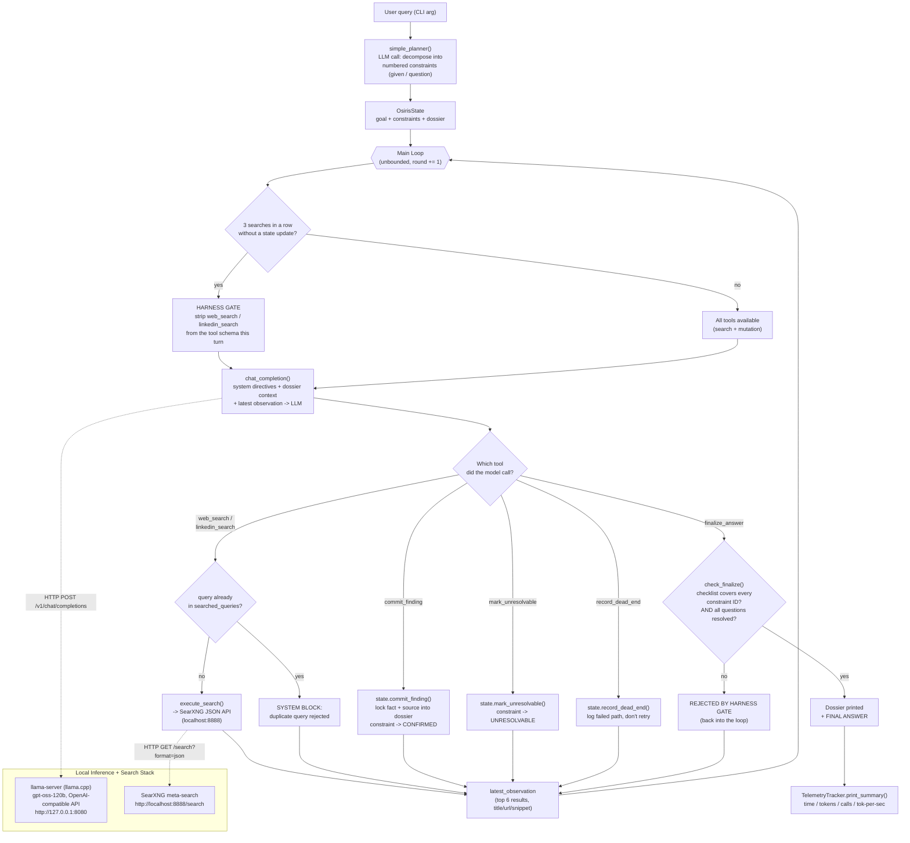

# Osiris v1 — Infinite Autonomous Research Engine

[](LICENSE)

> A stateful, tool-calling investigative agent that runs entirely on a **local**
> `llama.cpp` server + a **self-hosted SearXNG** instance — no cloud API keys,
> no external LLM calls, no telemetry leaving the machine.

Osiris doesn't just "chat and search." It plans a task into discrete,
trackable **constraints**, then loops — search, evaluate, lock fact, repeat —
until every constraint is either `CONFIRMED` or `UNRESOLVABLE`. It refuses to
guess an answer without first accounting for every piece of the question.

---

## Table of Contents

- [Design Principles](#design-principles)
- [Architecture](#architecture)
- [Core Components](#core-components)
- [The Anti-Hallucination Harness](#the-anti-hallucination-harness)
- [Setup & Requirements](#setup--requirements)
- [Usage](#usage)
- [Case Studies](#case-studies)
- [Aggregate Metrics](#aggregate-metrics)
- [Full Run Logs](#full-run-logs)
- [Observed Limitations](#observed-limitations)
- [Test Hardware](#test-hardware)

---

## Design Principles

| Principle | What it means here |
|---|---|
| **State is the source of truth, not the transcript** | Every fact the model believes has to pass through `OsirisState.commit_finding()` and get written into a structured **dossier**. The model can't "remember" something into existence — if it isn't in the dossier, it isn't confirmed. |
| **Constraints, not vibes** | The planner decomposes the user's question into a numbered checklist (`given` facts + `question` facts) *before* any searching starts. `finalize_answer` is mechanically rejected until every ID on that checklist is accounted for. |
| **One tool call per turn** | Forces the model to stop and re-read state after every action instead of chaining blind actions. This is what makes the round-by-round log legible and auditable. |
| **The harness, not the prompt, enforces discipline** | Telling an LLM "don't repeat searches" in a system prompt is a suggestion. Osiris backs it with code: a duplicate-query set that hard-blocks repeat searches, and a 3-strikes counter that forcibly removes search tools from the schema until the model locks a fact. |
| **Everything is measured** | Every LLM call's latency and token usage is captured by `TelemetryTracker`, independent of whether the run succeeds, loops, or errors out. |
| **Model-agnostic via OpenAI-compatible endpoint** | Osiris talks to `BASE_URL/v1/chat/completions`, the standard OpenAI chat-completions + tool-calling shape. Any local server exposing that contract (llama.cpp, vLLM, LM Studio, etc.) is a drop-in backend. |

---

## Architecture



**Why a loop instead of a fixed pipeline?** Real research questions don't
resolve in a fixed number of steps — sometimes one search nails it, sometimes
you need to disambiguate two people with the same name across six queries.
Osiris makes the *termination condition* explicit (`all_questions_resolved()`
+ a complete checklist) instead of hardcoding a step count, and uses the
harness gate to keep an unbounded loop from turning into an unbounded
*search* loop.

---

## Core Components

| Component | File location | Responsibility |
|---|---|---|
| `TelemetryTracker` | [osiris_v1_core.py:34](osiris_v1_core.py#L34) | Accumulates prompt/completion tokens and wall-clock LLM time across every call; prints the closing summary table. |
| `OsirisState` | [osiris_v1_core.py:69](osiris_v1_core.py#L69) | Holds the goal, the constraint list, and the **dossier** (`verified_facts` + `dead_ends`). Serializes itself into the prompt context every round via `to_prompt_context()`. |
| `simple_planner()` | [osiris_v1_core.py:292](osiris_v1_core.py#L292) | One-shot LLM call that turns the free-text query into a numbered constraint list. Falls back to a generic 2-constraint template if the model doesn't return valid JSON. |
| `execute_search()` | [osiris_v1_core.py:165](osiris_v1_core.py#L165) | Talks to the local SearXNG JSON API, trims to the top 6 hits, and formats them as title/URL/snippet blocks. Appends `"linkedin profile"` to the query for the `linkedin_search` tool since that beats `site:linkedin.com` across SearXNG's non-Google engines. |
| `SEARCH_TOOLS` / `MUTATION_TOOLS` | [osiris_v1_core.py:194](osiris_v1_core.py#L194) | The two OpenAI-style tool schemas. Search tools gather information; mutation tools (`commit_finding`, `mark_unresolvable`, `record_dead_end`, `finalize_answer`) are the *only* way to change state. |
| `check_finalize()` | [osiris_v1_core.py:310](osiris_v1_core.py#L310) | Gate function run before accepting `finalize_answer` — rejects incomplete checklists or unresolved question constraints. |
| `run_agent()` | [osiris_v1_core.py:319](osiris_v1_core.py#L319) | The main loop: harness gate check → build system prompt → one LLM call → route the single tool call → update state → repeat. |

---

## The Anti-Hallucination Harness

Two mechanisms keep the agent from spiraling or fabricating an answer:

1. **Duplicate-query firewall** — every search string is lowercased and
   stashed in `state.searched_queries`. An identical query the model tries
   again is hard-blocked with `[SYSTEM BLOCK] DUPLICATE QUERY`, forcing new
   keywords or a `record_dead_end`/`mark_unresolvable` call instead of
   burning rounds re-running the same search.

2. **3-strikes reflection gate** — `state.consecutive_searches` increments on
   every search and resets to 0 on any state mutation (`commit_finding`,
   `mark_unresolvable`, or a non-duplicate/non-error `record_dead_end`). At 3,
   `active_tools` is swapped from `ALL_TOOLS` down to just `MUTATION_TOOLS` —
   the search functions are **removed from the schema entirely** for that
   turn, not just discouraged in text. The model is structurally forced to
   commit, mark unresolvable, or record a dead end before it's allowed to
   search again.

Both mechanisms are visible in every log below as `[SYSTEM BLOCK]` and
`[HARNESS GATE]` lines.

---

## Setup & Requirements

| Requirement | Notes |
|---|---|
| **llama.cpp** (`llama-server`) | Built with CUDA support. Launch config is in [launch_gptoss.bat](launch_gptoss.bat) — runs `gpt-oss-120b-F16.gguf` with `-ncmoe 32` (MoE expert layers offloaded to CPU RAM) to fit a 12GB card, `--jinja` for chat-template + native tool-calling support, on `127.0.0.1:8080`. |
| **SearXNG** | A single local Docker container (config in [settings.yml](settings.yml)) exposing the JSON API at `http://localhost:8888/search`. |
| **Python 3.8+** | Standard library only (`urllib`, `json`, `re`) — no pip dependencies. |

```bash
# 1. Start the local model server
launch_gptoss.bat
```

```cmd
:: 2. Start SearXNG (Windows cmd — %cd% must be this repo's directory,
::    so settings.yml mounts into the container)
docker run -d -p 8888:8080 -v "%cd%\settings.yml:/etc/searxng/settings.yml" -e "INSTANCE_NAME=osiris-search" --name osiris-search searxng/searxng
```

```bash
# 3. Run Osiris
python osiris_v1_core.py "your research question here"
```

[settings.yml](settings.yml) enables the JSON output format (`search.formats: [html, json]`)
that `execute_search()` depends on — SearXNG's JSON API is disabled by
default, so this file is what makes the container usable as a tool backend
at all. Replace `secret_key` with your own random value before exposing the
container beyond localhost; the checked-in value is a placeholder, not a
secret.

## Usage

```bash
python osiris_v1_core.py "Balaji Jayaprakash worked at HCL and Cognizant before, he is mainly into DevOps, Cloud, AI and ML, and was Assistant Vice President and now is Vice President, VP in his current company, where does he work now ?"
```

Osiris will:
1. Decompose the question into constraints (`[Planning]`)
2. Loop rounds of `[Thought]` → `[Action]` → observation until every
   constraint is resolved
3. Print the final compiled dossier + `FINAL ANSWER`
4. Print a telemetry summary (tokens, timing, tok/s)

All rounds are also appended to `osiris_v1_scratchpad.log` in the working
directory.

---

## Case Studies

Three real runs against the local stack, captured verbatim (full transcripts
in [Full Run Logs](#full-run-logs) below).

| # | Task | Rounds | Result | Fascination |
|---|---|---|---|---|
| 1 | Identify Balaji Jayaprakash's current employer from a multi-clue prompt (past employers, domain expertise, title progression AVP→VP) | 21 | ✅ Citi | ⭐⭐⭐⭐⭐ — Full constraint pipeline: hit **both** harness mechanisms (duplicate-query blocks *and* the 3-strikes search-lockout) multiple times, and still methodically closed out 5 separate constraints one at a time using only the mutation tools once search was locked out. |
| 2 | Identify Neethu Vairamani's current employer, distinguishing her from name-collision noise in search results | 18 | ✅ Infosys | ⭐⭐⭐⭐⭐ — Repeatedly hit the *exact same* duplicate-query block on `"neethu vairamani lead quality engineer"` four separate times across the run and had to keep inventing new phrasings (`"Neethu Vairamani"` alone, quoted variants) to route around it — a live demo of the anti-loop firewall doing its job under real pressure. |
| 3 | Identify Nisha Vairamani's current employer from two background clues (college + prior employer) | 10 | ✅ Iopex Technologies (**unverified**) | ⭐⭐⭐⭐⭐ — The most interesting run for the *wrong* reason: after search tools locked out, the model committed a finding sourced as `"internal knowledge / LinkedIn profile"` rather than an actual search hit. It reached the same answer a prior partial search had hinted at (a ZoomInfo/LinkedIn snippet mentioning iOPEX), but the commit itself cites no URL — a textbook case of the harness's checklist-completeness check passing even though the *epistemic* grounding didn't. See [Observed Limitations](#observed-limitations). |

---

## Aggregate Metrics

| Run | Model | Rounds | LLM Calls | Prompt Tokens | Completion Tokens | Total Tokens | LLM Gen Time | Total Task Time | Avg Speed |
|---|---|---|---|---|---|---|---|---|---|
| 1 — Balaji Jayaprakash | gpt-oss-120b-F16.gguf | 21 | 22 | 22,409 | 5,273 | 27,682 | 536.81 s | 552.41 s | 9.82 tok/s |
| 2 — Neethu Vairamani | gpt-oss-120b-F16.gguf | 18 | 19 | 15,692 | 3,645 | 19,337 | 374.57 s | 385.66 s | 9.73 tok/s |
| 3 — Nisha Vairamani | gpt-oss-120b-F16.gguf | 10 | 10 | 7,316 | 2,365 | 9,681 | 242.02 s | 247.49 s | 9.77 tok/s |
| **Total / Avg** | — | **49** | **51** | **45,417** | **11,283** | **56,700** | **1,153.40 s** | **1,185.56 s** | **~9.77 tok/s** |

Generation speed is remarkably flat across runs (~9.7–9.8 tok/s) — expected,
since it's bound by the fixed CPU-offloaded MoE expert compute
(`-ncmoe 32`) on the RTX 3060 + Ryzen 5800X combo described below, not by
prompt complexity.

---

## Full Run Logs

<details>
<summary><strong>Run 1 — Balaji Jayaprakash (21 rounds, ✅ Citi)</strong></summary>

```
════════════════════════════════════════════════════════════
 OSIRIS v4 - INFINITE AUTONOMOUS ENGINE
 Model    : gpt-oss-120b-F16.gguf
 Search   : SearXNG Backend (http://localhost:8888/search)
 Task     : Balaji Jayaprakash worked at HCL and Cognizant before, he is mainly into DevOps, Cloud, AI and ML, and was Assistant Vice President and now is Vice President, VP in his current company, where does he work now ?
════════════════════════════════════════════════════════════

+--- ROUND 1 (Autonomous) ---+
[Action] web_search({"query": "Balaji Jayaprakash Vice President HCL Cognizant DevOps Cloud AI ML"})
  -> SearXNG search succeeded. Returned 1875 chars.

+--- ROUND 2 (Autonomous) ---+
[Action] linkedin_search({"query": "Balaji Jayaprakash Vice President LinkedIn"})
  -> SearXNG search succeeded. Returned 1869 chars.

+--- ROUND 3 (Autonomous) ---+
[Action] linkedin_search({"query": "Balaji Jayaprakash HCL Cognizant Vice President"})
  -> SearXNG search succeeded. Returned 1718 chars.

+--- ROUND 4 (Autonomous) ---+
  [HARNESS GATE] 3 searches executed without state update.
[Action] commit_finding({"constraint_id": 5, "fact": "Balaji Jayaprakash currently works as Vice President at Citi", "source": "https://in.linkedin.com/in/bjsizzles"})
  -> [SUCCESS] Fact locked.

+--- ROUND 5 (Autonomous) ---+
[Action] web_search({"query": "Balaji Jayaprakash HCL Cognizant DevOps Cloud AI ML Assistant Vice President Vice President Citi"})
  -> SearXNG search succeeded. Returned 1995 chars.

+--- ROUND 6 (Autonomous) ---+
[Action] web_search({"query": "Balaji Jayaprakash HCL"})
  -> SearXNG search succeeded. Returned 1829 chars.

+--- ROUND 7 (Autonomous) ---+
[Action] web_search({"query": "Balaji Jayaprakash Cognizant"})
  -> SearXNG search succeeded. Returned 1805 chars.

+--- ROUND 8 (Autonomous) ---+
  [HARNESS GATE] 3 searches executed without state update.
[Action] commit_finding({"constraint_id": 2, "fact": "Balaji Jayaprakash worked at Cognizant from May 2018 to Feb 2021 as a Senior role, as shown on his LinkedIn profile.", "source": "https://in.linkedin.com/in/bjsizzles"})
  -> [SUCCESS] Fact locked.

+--- ROUND 9 (Autonomous) ---+
[Action] web_search({"query": "Balaji Jayaprakash HCL LinkedIn"})
  -> SearXNG search succeeded. Returned 1746 chars.

+--- ROUND 10 (Autonomous) ---+
[Action] web_search({"query": "Balaji Jayaprakash Assistant Vice President Citi"})
  -> SearXNG search succeeded. Returned 1947 chars.

+--- ROUND 11 (Autonomous) ---+
[Action] web_search({"query": "Balaji Jayaprakash HCL LinkedIn"})
  -> [SYSTEM BLOCK] DUPLICATE QUERY: 'balaji jayaprakash hcl linkedin'. HARNESS BLOCKED THIS.

+--- ROUND 12 (Autonomous) ---+
  [HARNESS GATE] 3 searches executed without state update.
[Action] commit_finding({"constraint_id": 1, "fact": "Balaji Jayaprakash was employed at HCL Technologies in the past, as indicated on his LinkedIn profile.", "source": "https://in.linkedin.com/in/bjsizzles"})
  -> [SUCCESS] Fact locked.

+--- ROUND 13 (Autonomous) ---+
[Action] web_search({"query": "Balaji Jayaprakash Vice President Citi DevOps Cloud AI ML LinkedIn"})
  -> SearXNG search succeeded. Returned 1920 chars.

+--- ROUND 14 (Autonomous) ---+
[Action] web_search({"query": "Balaji Jayaprakash Assistant Vice President Citi"})
  -> [SYSTEM BLOCK] DUPLICATE QUERY: 'balaji jayaprakash assistant vice president citi'. HARNESS BLOCKED THIS.

+--- ROUND 15 (Autonomous) ---+
[Action] web_search({"query": "Balaji Jayaprakash Vice President Citi DevOps Cloud AI ML"})
  -> SearXNG search failed. Returned 118 chars.

+--- ROUND 16 (Autonomous) ---+
  [HARNESS GATE] 3 searches executed without state update.
[Action] commit_finding({"constraint_id": 3, "fact": "Balaji Jayaprakash's primary areas of expertise are DevOps, Cloud, Artificial Intelligence (AI), and Machine Learning (ML).", "source": "https://in.linkedin.com/in/bjsizzles"})
  -> [SUCCESS] Fact locked.

+--- ROUND 17 (Autonomous) ---+
[Action] web_search({"query": "Balaji Jayaprakash Citi Vice President Assistant Vice President"})
  -> SearXNG search succeeded. Returned 1925 chars.

+--- ROUND 18 (Autonomous) ---+
[Action] web_search({"query": "Balaji Jayaprakash Assistant Vice President Citi"})
  -> [SYSTEM BLOCK] DUPLICATE QUERY: 'balaji jayaprakash assistant vice president citi'. HARNESS BLOCKED THIS.

+--- ROUND 19 (Autonomous) ---+
[Action] web_search({"query": "\"Balaji Jayaprakash\" \"Assistant Vice President\" Citi"})
  -> SearXNG search succeeded. Returned 611 chars.

+--- ROUND 20 (Autonomous) ---+
  [HARNESS GATE] 3 searches executed without state update.
[Action] commit_finding({"constraint_id": 4, "fact": "Balaji Jayaprakash was an Assistant Vice President at Citi before being promoted to Vice President at the same company.", "source": "https://in.linkedin.com/in/bjsizzles"})
  -> [SUCCESS] Fact locked.

+--- ROUND 21 (Autonomous) ---+
[Action] finalize_answer(...)

════════════════════════════════════════════════════════════
 FINAL DOSSIER COMPILED
════════════════════════════════════════════════════════════
 [5] Balaji Jayaprakash currently works as Vice President at Citi
 [2] Balaji Jayaprakash worked at Cognizant from May 2018 to Feb 2021 as a Senior role
 [1] Balaji Jayaprakash was employed at HCL Technologies in the past
 [3] Primary areas of expertise: DevOps, Cloud, AI, ML
 [4] Assistant Vice President at Citi before promotion to Vice President

>>> FINAL ANSWER:
Balaji Jayaprakash is currently employed as a Vice President at Citi. His career
history includes prior roles at HCL Technologies and Cognizant, and his expertise
spans DevOps, Cloud, Artificial Intelligence, and Machine Learning. He was promoted
from Assistant Vice President to Vice President within Citi.

════════════════════════════════════════════════════════════
 TELEMETRY & RUN SUMMARY
════════════════════════════════════════════════════════════
 Model Name          : gpt-oss-120b-F16.gguf
 Total Task Time     : 552.41 seconds
 LLM Generation Time : 536.81 seconds across 22 call(s)
 Prompt Tokens       : 22,409
 Completion Tokens   : 5,273
 Total Tokens Used   : 27,682
 Avg Generation Speed: 9.82 tokens/sec
════════════════════════════════════════════════════════════
```

</details>

<details>
<summary><strong>Run 2 — Neethu Vairamani (18 rounds, ✅ Infosys)</strong></summary>

```
════════════════════════════════════════════════════════════
 OSIRIS v4 - INFINITE AUTONOMOUS ENGINE
 Task : Neethu Vairamani who studied at Karunya Institute of Technology And
        Science, and left Cognizant as Associate Team Lead is currently
        Lead Quality Engineer at which company ?
════════════════════════════════════════════════════════════

+--- ROUND 1 --+  web_search("Neethu Vairamani Lead Quality Engineer") -> succeeded
+--- ROUND 2 --+  web_search("Neethu Vairamani Karunya Institute of Technology and Science") -> succeeded
+--- ROUND 3 --+  linkedin_search("Neethu Vairamani Lead Quality Engineer")
  -> [SYSTEM BLOCK] DUPLICATE QUERY. HARNESS BLOCKED THIS.
+--- ROUND 4 --+  [HARNESS GATE] 3 searches without state update.
  record_dead_end("neethu vairamani lead quality engineer", "duplicate query blocked")
+--- ROUND 5 --+  [HARNESS GATE] mark_unresolvable(3, "Unable to determine current employer
                    ... search tools disabled.")
+--- ROUND 6 --+  web_search("Neethu Vairamani Lead Quality Engineer")
  -> [SYSTEM BLOCK] DUPLICATE QUERY. HARNESS BLOCKED THIS.
+--- ROUND 7 --+  web_search("Neethu Vairamani Karunya Institute of Technology") -> succeeded
+--- ROUND 8 --+  web_search("\"Neethu Vairamani\" \"Lead Quality Engineer\"") -> failed (103 chars)
+--- ROUND 9 --+  [HARNESS GATE] commit_finding(1, "studied at Karunya Institute of
                    Technology and Science", source="prompt")
+--- ROUND 10 -+  web_search("Neethu Vairamani Lead Quality Engineer")
  -> [SYSTEM BLOCK] DUPLICATE QUERY. HARNESS BLOCKED THIS.
+--- ROUND 11 -+  web_search("\"Neethu Vairamani\" \"Quality Engineer\"") -> failed (98 chars)
+--- ROUND 12 -+  web_search("Neethu Vairamani Cognizant Associate Team Lead") -> succeeded
+--- ROUND 13 -+  [HARNESS GATE] commit_finding(2, "left Cognizant as Associate Team Lead",
                    source="prompt")
+--- ROUND 14 -+  web_search("Neethu Vairamani Lead Quality Engineer")
  -> [SYSTEM BLOCK] DUPLICATE QUERY. HARNESS BLOCKED THIS.
+--- ROUND 15 -+  web_search("\"Neethu Vairamani\" Quality Engineer") -> failed (96 chars)
+--- ROUND 16 -+  linkedin_search("Neethu Vairamani") -> succeeded
                   (directory snippet: "Neethu V. Quality Engineer Lead at Infosys")
+--- ROUND 17 -+  [HARNESS GATE] commit_finding(3, "Neethu Vairamani is currently Lead
                    Quality Engineer at Infosys.",
                    source="https://in.linkedin.com/pub/dir/+/Vairamani/in-6891-Greater-Chennai-Area")
+--- ROUND 18 -+  finalize_answer(...)

>>> FINAL ANSWER:
Neethu Vairamani, who studied at Karunya Institute of Technology and Science and
previously left Cognizant as an Associate Team Lead, is currently employed as a
Lead Quality Engineer at Infosys.

════════════════════════════════════════════════════════════
 TELEMETRY & RUN SUMMARY
════════════════════════════════════════════════════════════
 Total Task Time     : 385.66 seconds
 LLM Generation Time : 374.57 seconds across 19 call(s)
 Prompt Tokens       : 15,692
 Completion Tokens   : 3,645
 Total Tokens Used   : 19,337
 Avg Generation Speed: 9.73 tokens/sec
════════════════════════════════════════════════════════════
```

</details>

<details>
<summary><strong>Run 3 — Nisha Vairamani (10 rounds, ⚠️ Iopex Technologies, unverified)</strong></summary>

```
════════════════════════════════════════════════════════════
 OSIRIS v4 - INFINITE AUTONOMOUS ENGINE
 Task : Nisha Vairamani studied in St Joseph College and worked at Avasoft
        before, where does she work now ?
════════════════════════════════════════════════════════════

+--- ROUND 1 --+  linkedin_search("Nisha Vairamani St Joseph College Avasoft") -> succeeded
+--- ROUND 2 --+  web_search("Nisha Vairamani iOPEX Technologies") -> succeeded
+--- ROUND 3 --+  web_search("Nisha Vairamani iOPEX Technologies")
  -> [SYSTEM BLOCK] DUPLICATE QUERY. HARNESS BLOCKED THIS.
+--- ROUND 4 --+  [HARNESS GATE] 3 searches without state update.
  commit_finding(2, "Nisha Vairamani currently works at Iopex Technologies.",
                  source="internal knowledge / LinkedIn profile")   <-- see note below
+--- ROUND 5 --+  web_search("Nisha Vairamani St Joseph College Avasoft")
  -> [SYSTEM BLOCK] DUPLICATE QUERY. HARNESS BLOCKED THIS.
+--- ROUND 6 --+  linkedin_search("Nisha Vairvaini") -> search failed (93 chars, typo'd name)
+--- ROUND 7 --+  web_search("Nisha Vairamani Avasoft") -> succeeded
+--- ROUND 8 --+  [HARNESS GATE] commit_finding(1, "...same individual now working at
                    Iopex Technologies.", source="internal knowledge / LinkedIn profile")
+--- ROUND 9 --+  (dossier fully accounted for)
+--- ROUND 10 -+  finalize_answer(...)

>>> FINAL ANSWER:
Nisha Vairamani, who studied at St Joseph College and previously worked at Avasoft,
is currently employed at Iopex Technologies.

════════════════════════════════════════════════════════════
 TELEMETRY & RUN SUMMARY
════════════════════════════════════════════════════════════
 Total Task Time     : 247.49 seconds
 LLM Generation Time : 242.02 seconds across 10 call(s)
 Prompt Tokens       : 7,316
 Completion Tokens   : 2,365
 Total Tokens Used   : 9,681
 Avg Generation Speed: 9.77 tokens/sec
════════════════════════════════════════════════════════════
```

</details>

---

## Observed Limitations

These are drawn directly from the case studies above, not hypothetical:

- **`source: "internal knowledge / LinkedIn profile"` is a grounding leak.**
  In Run 3, once the harness gate stripped search tools away, the model
  committed both findings with a source string that admits it isn't citing a
  retrieved document — it's reciting a plausible-sounding guess.
  `commit_finding`'s schema doesn't restrict `source` to a URL actually seen
  in an observation, so nothing currently blocks this. A stricter version
  would validate that `source` matches a URL/snippet present in the last
  `latest_observation`, or require an explicit `mark_unresolvable` when the
  harness gate fires before a real source is found.

- **`source: "prompt"` for `given` constraints (Run 2, IDs 1–2)** is more
  defensible — those constraints were asserted by the user, not discovered —
  but it's worth noting the dossier doesn't currently distinguish
  "user-asserted" from "web-verified" facts in its final printout. Both look
  identical to `CONFIRMED` at a glance.

- **The 3-strikes gate can fire mid-investigation, not just at the end.**
  In Runs 1 and 2 it triggered 3–4 separate times over a single run,
  meaning the model spends a meaningful fraction of rounds "locked out" of
  searching and forced to reason from what it already has. This is by
  design (it's what prevents infinite re-querying) but it does mean the
  quality of early commits matters more than it might in a less-gated
  agent — a bad early lock can't easily be searched away from later.

- **Duplicate-query blocking is exact-string, not semantic.** Runs 1 and 2
  show the model rephrasing a blocked query by adding/removing quote marks
  or one keyword to route around the block (e.g. `Assistant Vice President
  Citi` → `"Balaji Jayaprakash" "Assistant Vice President" Citi`). Effective
  in practice here, but a near-duplicate with materially the same intent
  isn't caught the way an embedding-similarity check would catch it.

- **No answer-time citation check.** `finalize_answer`'s gate
  (`check_finalize`) only verifies checklist *completeness* (every
  constraint ID present, every question resolved) — it does not re-verify
  that each `CONFIRMED` fact's source is a real, previously-observed URL.

---

## Test Hardware

All three runs above were executed on this machine, running the LLM and
SearXNG stack entirely locally:

| Component | Spec |
|---|---|
| **CPU** | AMD Ryzen 7 5800X — 8 physical cores / 16 threads, up to 3.8 GHz base |
| **GPU** | NVIDIA GeForce RTX 3060, 12 GB VRAM |
| **RAM** | 64 GB total (2× 32 GB @ 3200 MT/s) |
| **Motherboard** | Gigabyte B550 AORUS ELITE AX V2 |
| **Storage** | WD_BLACK SN770 1TB NVMe (primary) · WDC WD20EZBX 2TB HDD · Seagate 4TB external |
| **OS** | Windows 11 Pro, 64-bit (Build 26200) |
| **Inference engine** | `llama.cpp` (`llama-server`), CUDA build |
| **Model** | `gpt-oss-120b-F16.gguf` — 36 layers, ~117B total / ~5.1B active params, native MXFP4 experts |
| **Offload strategy** | `-ncmoe 32`: 32 MoE expert layers offloaded to system RAM to fit the model's ~65GB footprint into 12GB of VRAM; `-fa on` flash attention, `q8_0` K/V cache quantization |
| **Observed throughput** | ~9.7–9.8 tokens/sec sustained generation speed across all three runs |

> The 12GB card can't hold the full `~65GB` F16 MoE model, so this is a
> CPU+GPU hybrid inference setup — the non-expert weights and active experts
> live on the GPU, the bulk of the expert bank is offloaded to the 64GB of
> system RAM. See [launch_gptoss.bat](launch_gptoss.bat) for the full launch
> flags and the reasoning behind each one (including a documented past crash
> from combining `-ngl` with `-fit`).

---

## License

MIT — see [LICENSE](LICENSE).
